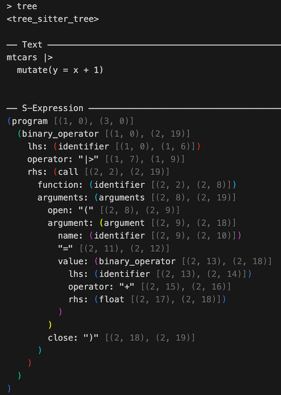

<!-- README.md is generated from README.Rmd. Please edit that file -->

# treesitter

<!-- badges: start -->

[](https://github.com/DavisVaughan/r-tree-sitter/actions/workflows/R-CMD-check.yaml)
[](https://app.codecov.io/gh/DavisVaughan/r-tree-sitter?branch=main)
<!-- badges: end -->

treesitter provides R bindings to
[tree-sitter](https://github.com/tree-sitter/tree-sitter), an
incremental parsing system. It can build a concrete syntax tree for a
source file and efficiently update the syntax tree as the source file is
edited. tree-sitter is useful for a number of things, including syntax
highlighting, go-to definition, code reshaping, and more.

## Installation

Install treesitter from CRAN with:

``` r
install.packages("treesitter")
```

This package does *not* provide bindings to a language specific
tree-sitter *grammar*. To fully utilize the treesitter package, you will
also need to install a grammar specific R package. Currently there is
just one, for R:

``` r
install.packages("treesitter.r")
```

You can install the development version of treesitter from
[GitHub](https://github.com/) with:

``` r
# install.packages("pak")
pak::pak("DavisVaughan/r-tree-sitter")
```

## Example

With treesitter, you can parse a string containing code for any language
that you have a grammar for. Here’s an example with R code:

``` r
library(treesitter, warn.conflicts = FALSE)

# Language specific grammars come from extension packages
language <- treesitter.r::language()
parser <- parser(language)

# Imagine this is a source document
text <- "
1 + 2
"

# Parse the text and display the resulting syntax tree
parser_parse(parser, text)
#> <tree_sitter_tree>
#> 
#> ── Text ────────────────────────────────────────────────────────────────────────
#> 1 + 2
#> 
#> 
#> ── S-Expression ────────────────────────────────────────────────────────────────
#> (program [(1, 0), (2, 0)]
#>   (binary_operator [(1, 0), (1, 5)]
#>     lhs: (float [(1, 0), (1, 1)])
#>     operator: "+" [(1, 2), (1, 3)]
#>     rhs: (float [(1, 4), (1, 5)])
#>   )
#> )
```

Syntax trees can get pretty complex, here’s a larger example:

``` r
text <- "
mtcars |>
  mutate(y = x + 1)
"

tree <- parser_parse(parser, text)
```

Trees and nodes have a pretty nice print method that colors matching
parentheses and dims the locations. If you were to print out `tree` in
your R console, here’s what you’d see:



treesitter has a number of tools for navigating around and walking the
tree:

``` r
# The right hand side of the pipe
node <- tree |>
  tree_root_node() |>
  node_child(1) |>
  node_child_by_field_name("rhs")

node_text(node)
#> [1] "mutate(y = x + 1)"
```

By default, printing a node in the tree will show both the *anonymous*
nodes and the *named* nodes. Anonymous nodes help you see the full
“concrete” syntax tree that tree-sitter builds. If you want to see
something more akin to an abstract syntax tree, you can use
`node_show_s_expression()`, which has a number of options for
customizing the tree view:

``` r
# Full detail
node_show_s_expression(node)
#> (call [(2, 2), (2, 19)]
#>   function: (identifier [(2, 2), (2, 8)])
#>   arguments: (arguments [(2, 8), (2, 19)]
#>     open: "(" [(2, 8), (2, 9)]
#>     argument: (argument [(2, 9), (2, 18)]
#>       name: (identifier [(2, 9), (2, 10)])
#>       "=" [(2, 11), (2, 12)]
#>       value: (binary_operator [(2, 13), (2, 18)]
#>         lhs: (identifier [(2, 13), (2, 14)])
#>         operator: "+" [(2, 15), (2, 16)]
#>         rhs: (float [(2, 17), (2, 18)])
#>       )
#>     )
#>     close: ")" [(2, 18), (2, 19)]
#>   )
#> )
```

``` r

# Compact view, more like an AST
node_show_s_expression(
  node,
  show_anonymous = FALSE,
  show_locations = FALSE,
  dangling_parenthesis = FALSE
)
#> (call
#>   function: (identifier)
#>   arguments: (arguments
#>     argument: (argument
#>       name: (identifier)
#>       value: (binary_operator
#>         lhs: (identifier)
#>         rhs: (float)))))
```
